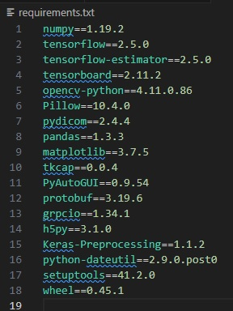
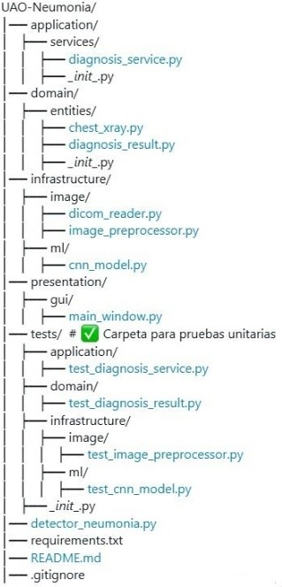
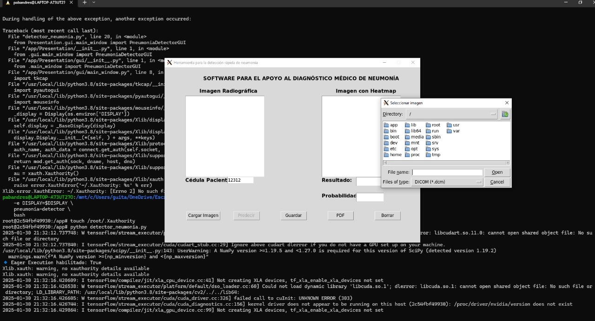

## Proyecto deteccion neumonia con IA 

## Grupo 3
## Integrantes: 

Pablo Andrés Muñoz Martínez 
                Código: 2244676 

Lady Yasmin Hoyos Parra 
                Código: 2245224 

Johan David Mendoza Vargas
                Código: 2245019

Yineth Tatiana Hernández Narvaez 
                Código: 2244789 

## Introducción

Este proyecto tiene como objetivo principal desarrollar un sistema basado en inteligencia artificial (IA) que permita identificar la presencia de neumonía en imágenes de radiografías de tórax. Para dicho objetivo se basó en un repositorio proporcionado, el cual contenía parte del código y la estructura necesaria para el sistema. 
En este documento, describe los pasos que se implementaron para completar el código, asegurar su correcto funcionamiento y garantizar la calidad del sistema mediante pruebas unitarias. Además, se incluyen las soluciones implementadas para alcanzar el objetivo del proyecto.

## Pasos Realizados

## 1. Clonación del Repositorio
El primer paso fue clonar el repositorio proporcionado que nos permitió obtener una copia local del proyecto en el entorno de desarrollo.

## 2. Configuración del Entorno con Docker
Para garantizar que el sistema funcione en un entorno controlado, se utilizó Docker. Esto permitió desplegar el sistema en un entorno aislado y asegurar que todas las dependencias estuvieran correctamente instaladas.

## 3. Funciones

## def from_file

La función from_file es un método de clase que crea una instancia de ChestXray a partir de un archivo de imagen. Maneja dos tipos de formatos: DICOM (formato especializado para imágenes médicas) y JPG/PNG. Para archivos DICOM, realiza una serie de transformaciones para normalizar la imagen: la convierte a escala de grises, la normaliza a valores entre 0 y 255, y finalmente la convierte a formato RGB. Para archivos JPG/PNG, simplemente lee la imagen directamente. En ambos casos, crea y retorna un nuevo objeto ChestXray con el ID del paciente, la imagen procesada y el tipo de imagen correspondiente.

Las versiones que se utilizaron finalmente para la implementación del proyecto son las siguientes:

También se implementó el dockerfile que define un entorno de contenedor y configura un entorno reproducible para ejecutar la aplicación de Python, incluyendo todas las dependencias del sistema y las librerías necesarias, y establece un comando para iniciar la aplicación al correr el contenedor

# 4 Implementación de un patrón de diseño 
Para facilitar el desarrollo y las pruebas unitarias, se implementó un diseño de arquitectura en capas. Este enfoque permite separar las responsabilidades del sistema en diferentes componentes, lo que hace que el código sea más modular, mantenible y fácil de probar. Las capas implementadas fueron:

Capa de Presentación: Encargada de la interacción con el usuario, como la carga y visualización de imágenes.
Capa de Lógica de Negocio: Contiene el algoritmo de predicción de neumonía y la lógica principal del sistema.
Capa de Acceso a Datos: Gestiona la carga y el procesamiento de las imágenes de radiografías.

Esta separación en capas permitió realizar pruebas unitarias de manera más eficiente, ya que cada capa pudo ser probada de forma independiente.

La estructura de este  proyecto implementa una arquitectura por capas para un sistema de detección de neumonía usando IA. Vamos a desglosar cada capa y su propósito:

## Capa de Aplicación (application/)

Contiene los servicios que coordinan la lógica de negocio
diagnosis_service.py: Maneja el flujo del proceso de diagnóstico, coordinando entre el procesamiento de imágenes y el modelo de IA

## Capa de Dominio (domain/)

Define las entidades centrales del negocio
chest_xray.py: Representa la radiografía de tórax
diagnosis_result.py: Modela el resultado del diagnóstico

## Carpeta image/:
Contiene las imagenes se usan en el readme 

## Capa de Infraestructura (infrastructure/)

Implementa los detalles técnicos y la integración con tecnologías específicas
## Carpeta image/:

dicom_reader.py: Lee imágenes en formato DICOM (formato estándar médico)
image_preprocessor.py: Prepara las imágenes para el modelo de IA

## Carpeta ml/:

cnn_model.py: Implementa la red neuronal convolucional para la detección

## Capa de Presentación (presentation/)

Maneja la interfaz de usuario
main_window.py: Implementa la interfaz gráfica principal

## Pruebas (tests/)

Estructura de pruebas que refleja la estructura del proyecto
Incluye pruebas unitarias para cada componente principal

## Archivos Principales:

detector_neumonia.py: Punto de entrada principal de la aplicación
requirements.txt: Lista las dependencias del proyecto
README.md: Documentación del proyecto
.gitignore: Especifica archivos que Git debe ignorar

## Esta arquitectura por capas ofrece varios beneficios:

- Separación clara de responsabilidades
- Facilita el mantenimiento y las pruebas
- Permite cambiar componentes sin afectar otras partes del sistema
- Organización clara para nuevos desarrolladores que se unan al proyecto

## 5. Pruebas Unitarias
Las pruebas se enfocaron en las siguientes funciones:

Prueba en diagnosis_service: Se verificó que la funciones se ejecuten de manera eficiente.
Prueba en chest_xray: se hicieron pruebas de carga de archivos jpge y Dicom para que estuviera bien su funcionamiento

## 5. Despliegue 

Una vez completado el código y las pruebas, se desplegó el sistema en un entorno local con linux utilizando Docker para luego crear una imagen en un contenedor para que se ejecute el proyecto, de acuerdo a esto se sube contenedor a docker hub, el cual se puede ver en el siguiente link: 
[linkDockerHub](https://hub.docker.com/repository/docker/pabandres13/pneumonia-detector/general)

